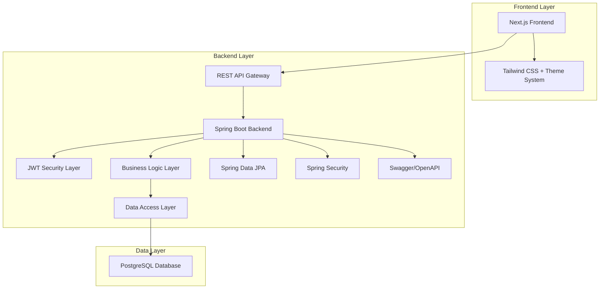
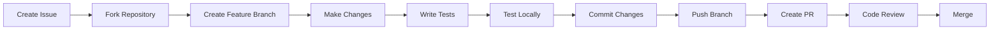

# 🎓 SkillSwap - Student Skill Exchange Platform

<div align="center">


**A revolutionary platform where students exchange skills, collaborate, and grow together — completely free of charge.**

[🚀 Live Demo](#) • [📖 Documentation](#) • [🐛 Report Bug](https://github.com/sanketshinde2005/SkillSwap/issues) • [✨ Request Feature](https://github.com/sanketshinde2005/SkillSwap/issues)

---

</div>

## 📋 Table of Contents

- [🎯 Overview](#-overview)
- [✨ Features](#-features)
- [🏗️ Architecture](#️-architecture)
- [🛠️ Tech Stack](#️-tech-stack)
- [🚀 Getting Started](#-getting-started)
- [📁 Project Structure](#-project-structure)
- [🔧 API Documentation](#-api-documentation)
- [🎨 Frontend Features](#-frontend-features)
- [🔐 Authentication & Security](#-authentication--security)
- [🗄️ Database Schema](#️-database-schema)
- [🧪 Testing](#-testing)
- [🚀 Deployment](#-deployment)
- [🤝 Contributing](#-contributing)
- [📝 License](#-license)
- [👥 Authors](#-authors)
- [🙏 Acknowledgments](#-acknowledgments)

---

## 🎯 Overview

SkillSwap is a comprehensive **student-driven skill exchange platform** built with modern web technologies. Our mission is to create a collaborative learning environment where students can:

- **Exchange skills** without monetary transactions
- **Build meaningful connections** through knowledge sharing
- **Accelerate learning** through peer-to-peer education
- **Foster community growth** in educational institutions

### 🎯 Core Philosophy

> _"Education is not the filling of a pail, but the lighting of a fire."_ - W.B. Yeats

SkillSwap embodies this philosophy by creating opportunities for students to teach, learn, and grow together in a supportive, judgment-free environment.

---

## ✨ Features

### 👤 User Management

- 🔐 **Secure Authentication** with JWT tokens
- 📝 **Easy Registration** with role-based access (Student/Admin)
- 👥 **Profile Management** with skill preferences
- 🔄 **Session Management** with automatic token refresh

### 🎓 Skill Exchange System

- 📚 **Skill Listing** - Offer or request skills
- 🔄 **Swap Requests** - Initiate skill exchange proposals
- ✅ **Admin Approval** - Quality control for all swaps
- 📊 **Status Tracking** - Monitor swap progress (PENDING → APPROVED → COMPLETED)

### 👨‍💼 Admin Dashboard

- 👀 **Swap Oversight** - Review and approve/reject swap requests
- 📈 **Platform Analytics** - Monitor user engagement and skill trends
- 🛡️ **User Management** - Admin controls for platform maintenance
- 📋 **Audit Trail** - Complete logging of all platform activities

### 🎨 Modern UI/UX

- 🌙 **Dark/Light Theme** - Seamless theme switching
- 📱 **Responsive Design** - Works perfectly on all devices
- ⚡ **Fast Performance** - Optimized with Next.js and Spring Boot
- 🎯 **Intuitive Interface** - Clean, modern design with Tailwind CSS

### 🔒 Security Features

- 🛡️ **Spring Security** integration
- 🔐 **JWT Authentication** with secure token handling
- 🧱 **CORS Configuration** for cross-origin requests
- ✅ **Input Validation** and sanitization
- 🚫 **SQL Injection Prevention** with JPA/Hibernate

---

## 🏗️ Architecture



### 🏛️ System Architecture

- **Frontend**: Next.js 16 with App Router, TypeScript, Tailwind CSS
- **Backend**: Spring Boot 3.2.5 with layered architecture
- **Database**: PostgreSQL with JPA/Hibernate ORM
- **Security**: JWT-based authentication with Spring Security
- **API**: RESTful APIs with OpenAPI/Swagger documentation

---

## 🛠️ Tech Stack

### 🎨 Frontend

```json
{
  "framework": "Next.js 16.1.4",
  "language": "TypeScript",
  "styling": "Tailwind CSS",
  "state": "React Hooks + Context API",
  "http": "Axios",
  "notifications": "React Hot Toast",
  "icons": "Built-in CSS"
}
```

### ⚙️ Backend

```xml
<properties>
  <spring-boot.version>3.2.5</spring-boot.version>
  <java.version>17</java.version>
  <jwt.version>0.11.5</jwt.version>
  <swagger.version>2.5.0</swagger.version>
</properties>
```

| Component | Technology      | Version | Purpose                        |
| --------- | --------------- | ------- | ------------------------------ |
| Framework | Spring Boot     | 3.2.5   | REST API development           |
| Language  | Java            | 17      | Backend logic                  |
| Security  | Spring Security | 6.x     | Authentication & Authorization |
| Database  | PostgreSQL      | 15      | Data persistence               |
| ORM       | Hibernate/JPA   | 6.x     | Object-relational mapping      |
| Auth      | JJWT            | 0.11.5  | JWT token management           |
| Docs      | OpenAPI/Swagger | 2.5.0   | API documentation              |
| Build     | Maven           | 3.9.x   | Dependency management          |

---

## 🚀 Getting Started

### 📋 Prerequisites

Before running this application, make sure you have the following installed:

- **Java**: JDK 17 or higher
- **Node.js**: v18 or higher
- **PostgreSQL**: v15 or higher
- **Maven**: v3.9.x or higher
- **Git**: Latest version

### 🗄️ Database Setup

1. **Install PostgreSQL** and create a database:

```bash
createdb skillswap_db
```

2. **Update database credentials** in `skillswap/src/main/resources/application.yml`:

```yaml
spring:
  datasource:
    url: jdbc:postgresql://localhost:5432/skillswap_db
    username: your_username
    password: your_password
```

### ⚙️ Backend Setup

1. **Clone the repository**:

```bash
git clone https://github.com/sanketshinde2005/SkillSwap.git
cd SkillSwap
```

2. **Navigate to backend directory**:

```bash
cd skillswap
```

3. **Install dependencies and run**:

```bash
# Using Maven wrapper (recommended)
./mvnw clean install
./mvnw spring-boot:run

# Or using system Maven
mvn clean install
mvn spring-boot:run
```

The backend will start on `http://localhost:8080`

### 🎨 Frontend Setup

1. **Open new terminal and navigate to frontend**:

```bash
cd frontend
```

2. **Install dependencies**:

```bash
npm install
```

3. **Start development server**:

```bash
npm run dev
```

The frontend will start on `http://localhost:3000`

### 🔍 API Documentation

Once both servers are running, visit:

- **Swagger UI**: `http://localhost:8080/swagger-ui.html`
- **OpenAPI JSON**: `http://localhost:8080/v3/api-docs`

---

## 📁 Project Structure

```
SkillSwap/
├── frontend/                          # Next.js Frontend
│   ├── app/                          # Next.js App Router
│   │   ├── admin/swaps/              # Admin dashboard
│   │   ├── login/                    # Authentication pages
│   │   ├── register/
│   │   ├── skills/                   # Skill management
│   │   ├── swaps/                    # Swap requests
│   │   ├── globals.css               # Global styles & themes
│   │   └── layout.tsx                # Root layout
│   ├── components/                   # Reusable React components
│   │   ├── Navbar.tsx                # Navigation with theme toggle
│   │   ├── SkillCard.tsx             # Skill display component
│   │   ├── SwapCard.tsx              # Swap request component
│   │   ├── ThemeProvider.tsx         # Theme context provider
│   │   └── ...
│   ├── lib/                          # Utility functions
│   │   ├── auth.ts                   # Authentication helpers
│   │   ├── api.ts                    # API client
│   │   ├── theme.ts                  # Theme configuration
│   │   └── ...
│   └── types/                        # TypeScript type definitions
│
├── skillswap/                        # Spring Boot Backend
│   ├── src/main/java/com/skillswap/
│   │   ├── SkillSwapApplication.java # Main application class
│   │   ├── auth/                     # Authentication module
│   │   │   ├── AuthController.java   # Auth endpoints
│   │   │   └── dto/                  # Auth data transfer objects
│   │   ├── config/                   # Configuration classes
│   │   │   ├── SecurityConfig.java   # Spring Security config
│   │   │   ├── CorsConfig.java       # CORS configuration
│   │   │   └── OpenApiConfig.java    # Swagger config
│   │   ├── exception/                # Global exception handling
│   │   ├── security/                 # Security components
│   │   │   ├── JwtService.java       # JWT token utilities
│   │   │   └── JwtAuthFilter.java    # JWT authentication filter
│   │   ├── skill/                    # Skill management
│   │   │   ├── Skill.java            # Skill entity
│   │   │   ├── SkillController.java  # Skill REST endpoints
│   │   │   └── SkillRepository.java  # Skill data access
│   │   ├── swap/                     # Swap request management
│   │   │   ├── SwapRequest.java      # Swap entity
│   │   │   ├── SwapRequestController.java
│   │   │   └── SwapStatus.java       # Enum for swap states
│   │   ├── user/                     # User management
│   │   │   ├── User.java             # User entity
│   │   │   ├── Role.java             # User roles enum
│   │   │   └── UserRepository.java   # User data access
│   │   └── test/                     # Test controller
│   ├── src/main/resources/
│   │   └── application.yml           # Application configuration
│   └── pom.xml                       # Maven dependencies
│
└── README.md                         # Project documentation
```

---

## 🔧 API Documentation

### 🔐 Authentication Endpoints

| Method | Endpoint             | Description       | Request Body      |
| ------ | -------------------- | ----------------- | ----------------- |
| `POST` | `/api/auth/register` | Register new user | `RegisterRequest` |
| `POST` | `/api/auth/login`    | User login        | `LoginRequest`    |

### 📚 Skill Management

| Method   | Endpoint           | Description      | Auth Required   |
| -------- | ------------------ | ---------------- | --------------- |
| `GET`    | `/api/skills`      | Get all skills   | ✅              |
| `POST`   | `/api/skills`      | Create new skill | ✅              |
| `GET`    | `/api/skills/{id}` | Get skill by ID  | ✅              |
| `DELETE` | `/api/skills/{id}` | Delete skill     | ✅ (Owner only) |

### 🔄 Swap Requests

| Method | Endpoint                  | Description                | Auth Required |
| ------ | ------------------------- | -------------------------- | ------------- |
| `GET`  | `/api/swaps/incoming`     | Get incoming swap requests | ✅            |
| `GET`  | `/api/swaps/outgoing`     | Get outgoing swap requests | ✅            |
| `POST` | `/api/swaps`              | Create swap request        | ✅            |
| `PUT`  | `/api/swaps/{id}/approve` | Approve swap (Admin only)  | ✅            |
| `PUT`  | `/api/swaps/{id}/reject`  | Reject swap (Admin only)   | ✅            |

### 📊 Admin Endpoints

| Method   | Endpoint                | Description           | Auth Required |
| -------- | ----------------------- | --------------------- | ------------- |
| `GET`    | `/api/admin/swaps`      | Get all swap requests | ✅ (Admin)    |
| `GET`    | `/api/admin/users`      | Get all users         | ✅ (Admin)    |
| `DELETE` | `/api/admin/users/{id}` | Delete user           | ✅ (Admin)    |

### 📋 Request/Response Examples

#### Register User

```bash
POST /api/auth/register
Content-Type: application/json

{
  "name": "John Doe",
  "email": "john@example.com",
  "password": "securepassword",
  "role": "STUDENT"
}
```

#### Create Skill

```bash
POST /api/skills
Authorization: Bearer <jwt-token>
Content-Type: application/json

{
  "name": "Java Programming",
  "type": "OFFER"
}
```

---

## 🎨 Frontend Features

### 🌙 Theme System

- **Automatic theme detection** based on user preference
- **Persistent theme storage** in localStorage
- **Smooth transitions** between light/dark modes
- **CSS custom properties** for consistent theming

### 📱 Responsive Design

- **Mobile-first approach** with Tailwind CSS
- **Adaptive layouts** for all screen sizes
- **Touch-friendly interfaces** for mobile users
- **Optimized performance** across devices

### 🔄 Real-time Updates

- **Live swap status updates**
- **Instant notifications** with React Hot Toast
- **Optimistic UI updates** for better UX
- **Automatic data synchronization**

### 🛡️ User Experience

- **Loading states** with skeleton components
- **Error handling** with user-friendly messages
- **Form validation** with real-time feedback
- **Accessibility features** built-in

---

## 🔐 Authentication & Security

### 🛡️ Spring Security Configuration

```java
@Configuration
@EnableWebSecurity
public class SecurityConfig {

    @Bean
    public SecurityFilterChain filterChain(HttpSecurity http) throws Exception {
        return http
            .csrf(csrf -> csrf.disable())
            .cors(cors -> cors.configurationSource(corsConfigurationSource()))
            .authorizeHttpRequests(auth -> auth
                .requestMatchers("/api/auth/**").permitAll()
                .requestMatchers("/swagger-ui/**", "/v3/api-docs/**").permitAll()
                .anyRequest().authenticated()
            )
            .sessionManagement(sess -> sess.sessionCreationPolicy(SessionCreationPolicy.STATELESS))
            .addFilterBefore(jwtAuthFilter, UsernamePasswordAuthenticationFilter.class)
            .build();
    }
}
```

### 🔑 JWT Implementation

- **Stateless authentication** with JWT tokens
- **Secure token generation** with HS256 algorithm
- **Automatic token refresh** mechanism
- **Role-based access control** (STUDENT/ADMIN)

### 🧱 Security Features

- **Password encryption** with BCrypt
- **CORS configuration** for frontend integration
- **SQL injection prevention** with JPA
- **Input validation** with Bean Validation
- **Security headers** configuration

---

## 🗄️ Database Schema

```sql
-- Users table
CREATE TABLE users (
    id BIGSERIAL PRIMARY KEY,
    name VARCHAR(255) NOT NULL,
    email VARCHAR(255) UNIQUE NOT NULL,
    password VARCHAR(255) NOT NULL,
    role VARCHAR(50) NOT NULL CHECK (role IN ('STUDENT', 'ADMIN')),
    created_at TIMESTAMP DEFAULT CURRENT_TIMESTAMP
);

-- Skills table
CREATE TABLE skills (
    id BIGSERIAL PRIMARY KEY,
    name VARCHAR(255) NOT NULL,
    type VARCHAR(50) NOT NULL CHECK (type IN ('OFFER', 'LEARN')),
    owner_email VARCHAR(255) NOT NULL,
    created_at TIMESTAMP DEFAULT CURRENT_TIMESTAMP,
    FOREIGN KEY (owner_email) REFERENCES users(email) ON DELETE CASCADE
);

-- Swap requests table
CREATE TABLE swap_requests (
    id BIGSERIAL PRIMARY KEY,
    skill_id BIGINT NOT NULL,
    sender_email VARCHAR(255) NOT NULL,
    receiver_email VARCHAR(255) NOT NULL,
    status VARCHAR(50) DEFAULT 'PENDING' CHECK (status IN ('PENDING', 'APPROVED', 'REJECTED')),
    created_at TIMESTAMP DEFAULT CURRENT_TIMESTAMP,
    updated_at TIMESTAMP DEFAULT CURRENT_TIMESTAMP,
    FOREIGN KEY (skill_id) REFERENCES skills(id) ON DELETE CASCADE,
    FOREIGN KEY (sender_email) REFERENCES users(email) ON DELETE CASCADE,
    FOREIGN KEY (receiver_email) REFERENCES users(email) ON DELETE CASCADE
);
```

### 📊 Entity Relationships

```
User (1) ──── (Many) Skills
User (1) ──── (Many) SwapRequests (as sender)
User (1) ──── (Many) SwapRequests (as receiver)
Skill (1) ──── (Many) SwapRequests
```

---

## 🧪 Testing

### 🧪 Backend Testing

```bash
# Run all tests
./mvnw test

# Run specific test class
./mvnw test -Dtest=AuthControllerTest

# Run with coverage
./mvnw test jacoco:report
```

### 🎨 Frontend Testing

```bash
# Run tests
npm test

# Run tests in watch mode
npm run test:watch

# Generate coverage report
npm run test:coverage
```

### 🔧 Test Structure

```
skillswap/src/test/java/
├── AuthControllerTest.java
├── SkillControllerTest.java
├── SwapRequestControllerTest.java
└── SecurityConfigTest.java

frontend/__tests__/
├── components/
├── pages/
└── utils/
```

---

## 🚀 Deployment

### 🐳 Docker Deployment

```dockerfile
# Backend Dockerfile
FROM openjdk:17-jdk-slim
WORKDIR /app
COPY target/*.jar app.jar
EXPOSE 8080
ENTRYPOINT ["java", "-jar", "app.jar"]
```

```dockerfile
# Frontend Dockerfile
FROM node:18-alpine
WORKDIR /app
COPY package*.json ./
RUN npm ci --only=production
COPY . .
RUN npm run build
EXPOSE 3000
CMD ["npm", "start"]
```

### ☁️ Cloud Deployment

#### Backend (Railway/Render/Heroku)

```bash
# Build and deploy
./mvnw clean package -DskipTests
# Upload JAR file to your cloud platform
```

#### Frontend (Vercel/Netlify)

```bash
# Deploy to Vercel
npm install -g vercel
vercel --prod

# Or deploy to Netlify
npm install -g netlify-cli
netlify deploy --prod --dir=out
```

### 🔧 Environment Variables

```bash
# Backend
DATABASE_URL=jdbc:postgresql://production-db:5432/skillswap
JWT_SECRET=your-super-secret-jwt-key
SPRING_PROFILES_ACTIVE=prod

# Frontend
NEXT_PUBLIC_API_URL=https://your-api-domain.com
```

---

## 🤝 Contributing

We welcome contributions from the community! Here's how you can help:

### 🚀 Getting Started

1. **Fork the repository**
2. **Create a feature branch**: `git checkout -b feature/amazing-feature`
3. **Make your changes** and test thoroughly
4. **Commit your changes**: `git commit -m 'Add amazing feature'`
5. **Push to the branch**: `git push origin feature/amazing-feature`
6. **Open a Pull Request**

### 📝 Contribution Guidelines

- **Code Style**: Follow existing code conventions
- **Testing**: Add tests for new features
- **Documentation**: Update README and API docs
- **Commits**: Use clear, descriptive commit messages
- **Issues**: Create issues for bugs and feature requests

### 🏗️ Development Workflow



---

## 📝 License

This project is licensed under the **MIT License** - see the [LICENSE](LICENSE) file for details.

```
MIT License

Copyright (c) 2026 Sanket Shinde

Permission is hereby granted, free of charge, to any person obtaining a copy
of this software and associated documentation files (the "Software"), to deal
in the Software without restriction, including without limitation the rights
to use, copy, modify, merge, publish, distribute, sublicense, and/or sell
copies of the Software, and to permit persons to whom the Software is
furnished to do so, subject to the following conditions:

The above copyright notice and this permission notice shall be included in all
copies or substantial portions of the Software.
```

---

## 👥 Authors

### 🎯 Project Lead

- **Sanket Shinde** - _Full-Stack Developer_ - [GitHub](https://github.com/sanketshinde2005)

### 🤝 Contributors

- **Community Contributors** - We welcome all contributions!

---

## 🙏 Acknowledgments

### 📚 Inspiration

- **Peer-to-peer learning** movement
- **Open source education** initiatives
- **Student collaboration** platforms

### 🛠️ Technologies & Tools

- **Spring Boot Community** for excellent documentation
- **Next.js Team** for the amazing framework
- **PostgreSQL** for reliable database solutions
- **Tailwind CSS** for utility-first styling

### 🎓 Special Thanks

- **Educational institutions** supporting skill development
- **Open source community** for inspiration and tools
- **Students worldwide** who believe in collaborative learning

---

## 📞 Support

Need help? Here's how to get in touch:

- **🐛 Bug Reports**: [GitHub Issues](https://github.com/sanketshinde2005/SkillSwap/issues)
- **💡 Feature Requests**: [GitHub Discussions](https://github.com/sanketshinde2005/SkillSwap/discussions)
- **📧 Email**: sanketshinde1827@gmail.com
- **💬 Discord**: [Join our community](#)

---

## 🎯 Roadmap

### 🚀 Upcoming Features

- [ ] **Real-time chat** for swap coordination
- [ ] **Skill rating system** for quality assurance
- [ ] **Mobile app** (React Native)
- [ ] **Video tutorials** integration
- [ ] **Advanced analytics** dashboard
- [ ] **Multi-language support**
- [ ] **Integration with learning platforms**

### 🔄 Version History

#### v1.0.0 (Current)

- ✅ Complete skill exchange system
- ✅ User authentication & authorization
- ✅ Admin dashboard
- ✅ Dark/light theme support
- ✅ Responsive design
- ✅ RESTful API with documentation

---

<div align="center">

**Made with ❤️ by students, for students**

⭐ **Star this repo** if you found it helpful!

[⬆️ Back to Top](#-skillswap---student-skill-exchange-platform)

</div>
