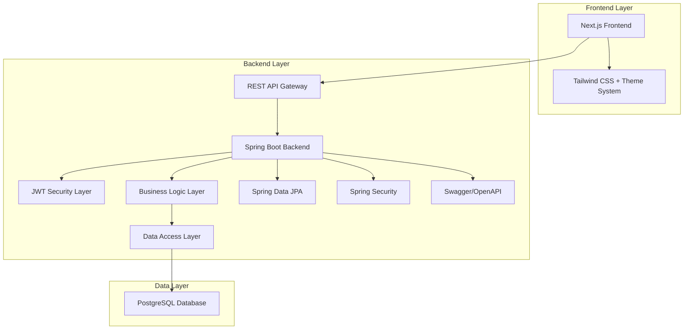
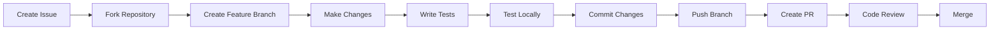

# 🎓 SkillSwap - Student Skill Exchange Platform


<div align="center">
    


**A platform where students exchange skills, collaborate, and grow together — completely free of charge.**

[🚀 Live Demo](https://skillswap-sigma-swart.vercel.app/) • [📖 Documentation](#) • [🐛 Report Bug](https://github.com/sanketshinde2005/SkillSwap/issues) • [✨ Request Feature](https://github.com/sanketshinde2005/SkillSwap/issues)

---

</div>

## 📋 Table of Contents

- [Overview](#-overview)
- [Features](#-features)
- [Architecture](#️-architecture)
- [Tech Stack](#️-tech-stack)
- [Getting Started](#-getting-started)
- [Project Structure](#-project-structure)
- [API Documentation](#-api-documentation)
- [Frontend Features](#-frontend-features)
- [Authentication & Security](#-authentication--security)
- [Database Schema](#️-database-schema)
- [Testing](#-testing)
- [Deployment](#-deployment)
- [Contributing](#-contributing)
- [License](#-license)
- [Authors](#-authors)
- [Acknowledgments](#-acknowledgments)

---

## Overview

SkillSwap is a comprehensive **student-driven skill exchange platform** built with modern web technologies. Our mission is to create a collaborative learning environment where students can:

- **Exchange skills** without monetary transactions
- **Build meaningful connections** through knowledge sharing
- **Accelerate learning** through peer-to-peer education
- **Foster community growth** in educational institutions

### 🎯 Core Philosophy

> _"Education is not the filling of a pail, but the lighting of a fire."_ - W.B. Yeats

SkillSwap embodies this philosophy by creating opportunities for students to teach, learn, and grow together in a supportive, judgment-free environment.

---

## Features

### 👤 User Management

- **Secure Authentication** with JWT tokens.
- **Easy Registration** with role-based access (Student/Admin).
- **Profile Management** featuring swap statistics (Incoming/Outgoing approved counts).
- **Session Management** with secure client-side storage.

### 🎓 Skill Exchange System (True Barter)
- **Dual Listing** - Create "OFFER" (what you teach) or "LEARN" (what you want) listings.
- **Peer-to-Peer Proposals** - Propose a swap by selecting which of *your* skills you will give in return for the skill you want.
- **Skill Locking** - Skills are automatically locked once a swap is approved to prevent double-booking.
- **Soft Delete** - Skills can be deactivated without breaking transaction history.
- **Admin/Peer Approval** - Direct receiver approval with optional admin oversight.

### 💬 Communication & Notifications

- **Swap-Specific Chat** - Real-time messaging available exclusively for approved swap partners.
- **Unified Notification Feed** - A centralized "Updates" box for new messages and swap status changes (Approved/Rejected).
- **Smart Polling** - Optimized message fetching to keep conversations fluid.
- 
### 👨‍💼 Admin Dashboard

- **Swap Oversight** - Review every barter request on the platform.
- **Platform Analytics** - Real-time stats on pending, approved, and rejected swaps.
- **Role-Based Routing** - Automated redirection based on user privileges.

### 🎨 Modern UI/UX

- **Aesthetic Theme System** - Sophisticated light and dark modes.
- **Responsive Design** - Fluid layouts for desktop, tablet, and mobile.
- **3D Visuals** - Interactive 3D cube hero section using CSS perspective.
- **Neobrutalist Elements** - Bold borders and high-contrast cards for a modern feel.

### 🔒 Security Features

- **Spring Security** integration
- **JWT Authentication** with secure token handling
- **CORS Configuration** for cross-origin requests
- **Input Validation** and sanitization
- **SQL Injection Prevention** with JPA/Hibernate

---

## 🏗️ Architecture



### 🏛️ System Architecture

- **Frontend**: Next.js 16 with App Router, TypeScript, Tailwind CSS
- **Backend**: Spring Boot 3.2.5 with layered architecture
- **Database**: PostgreSQL with JPA/Hibernate ORM
- **Security**: JWT-based authentication with Spring Security
- **API**: RESTful APIs with OpenAPI/Swagger documentation

---

## 🛠️ Tech Stack

### 🎨 Frontend

```json
{
  "framework": "Next.js 16.1.4",
  "language": "TypeScript",
  "styling": "Tailwind CSS",
  "state": "React Hooks + Context API",
  "http": "Axios",
  "notifications": "React Hot Toast",
  "icons": "Built-in CSS"
}
```

### ⚙️ Backend

```xml
<properties>
  <spring-boot.version>3.2.5</spring-boot.version>
  <java.version>17</java.version>
  <jwt.version>0.11.5</jwt.version>
  <swagger.version>2.5.0</swagger.version>
</properties>
```

| Component | Technology      | Version | Purpose                        |
| --------- | --------------- | ------- | ------------------------------ |
| Framework | Spring Boot     | 3.2.5   | REST API development           |
| Language  | Java            | 17      | Backend logic                  |
| Security  | Spring Security | 6.x     | Authentication & Authorization |
| Database  | PostgreSQL      | 15      | Data persistence               |
| ORM       | Hibernate/JPA   | 6.x     | Object-relational mapping      |
| Auth      | JJWT            | 0.11.5  | JWT token management           |
| Docs      | OpenAPI/Swagger | 2.5.0   | API documentation              |
| Build     | Maven           | 3.9.x   | Dependency management          |

---

## Getting Started

### 📋 Prerequisites

Before running this application, make sure you have the following installed:

- **Java**: JDK 17 or higher
- **Node.js**: v18 or higher
- **PostgreSQL**: v15 or higher
- **Maven**: v3.9.x or higher
- **Git**: Latest version

### 🗄️ Database Setup

1. **Install PostgreSQL** and create a database:

```bash
createdb skillswap_db
```

2. **Update database credentials** in `skillswap/src/main/resources/application.yml`:

```yaml
spring:
  datasource:
    url: jdbc:postgresql://localhost:5432/skillswap_db
    username: your_username
    password: your_password
```

### ⚙️ Backend Setup

1. **Clone the repository**:

```bash
git clone https://github.com/sanketshinde2005/SkillSwap.git
cd SkillSwap
```

2. **Navigate to backend directory**:

```bash
cd skillswap
```

3. **Install dependencies and run**:

```bash
# Using Maven wrapper (recommended)
./mvnw clean install
./mvnw spring-boot:run

# Or using system Maven
mvn clean install
mvn spring-boot:run
```

The backend will start on `http://localhost:8080`

### 🎨 Frontend Setup

1. **Open new terminal and navigate to frontend**:

```bash
cd frontend
```

2. **Install dependencies**:

```bash
npm install
```

3. **Start development server**:

```bash
npm run dev
```

The frontend will start on `http://localhost:3000`

### 🔍 API Documentation

Once both servers are running, visit:

- **Swagger UI**: `http://localhost:8080/swagger-ui.html`
- **OpenAPI JSON**: `http://localhost:8080/v3/api-docs`

---

## 📁 Project Structure

```
└── sanketshinde2005-skillswap/              # Root Project Directory
    ├── README.md                            # Comprehensive project overview, setup instructions, and tech stack
    ├── frontend/                            # Next.js Application (User Interface)
    │   ├── README.md                        # Frontend-specific setup and environment variable guide
    │   ├── eslint.config.mjs                # Linting rules for maintaining clean and consistent code
    │   ├── FORCE_GITHUB_REFRESH.txt         # Trigger file for CI/CD or metadata refresh
    │   ├── next-env.d.ts                    # Next.js TypeScript type definitions (auto-generated)
    │   ├── next.config.ts                   # Next.js specific configurations (rewrites, images, etc.)
    │   ├── package.json                     # Frontend dependencies and scripts (dev, build, start)
    │   ├── postcss.config.mjs               # PostCSS setup for processing Tailwind CSS
    │   ├── tsconfig.json                    # TypeScript compiler settings and path aliases (@/*)
    │   ├── app/                             # Next.js App Router - Contains all routes and layouts
    │   │   ├── globals.css                  # Global styles, variables, and Neobrutalist theme definitions
    │   │   ├── layout.tsx                   # Root layout providing Theme and Toast context to all pages
    │   │   ├── page.tsx                     # Landing page with interactive 3D hero and "How it works"
    │   │   ├── admin/                       # Admin-restricted area
    │   │   │   └── swaps/
    │   │   │       └── page.tsx             # Panel for Admins to verify and approve global swap requests
    │   │   ├── chat/                        # Direct messaging module
    │   │   │   └── [swapId]/
    │   │   │       └── page.tsx             # Real-time chat interface for approved swap partners
    │   │   ├── login/
    │   │   │   └── page.tsx                 # Secure login form with JWT session handling
    │   │   ├── profile/
    │   │   │   └── page.tsx                 # User dashboard showing personal stats and owned skills
    │   │   ├── register/
    │   │   │   └── page.tsx                 # New student/admin account creation
    │   │   ├── skills/
    │   │   │   └── page.tsx                 # Main hub to browse "Available to Learn" and "My Offers"
    │   │   └── swaps/
    │   │       └── page.tsx                 # Manage incoming requests and outgoing proposals
    │   ├── components/                      # Reusable UI Components
    │   │   ├── AddSkillForm.tsx             # Simple form component to register a new skill
    │   │   ├── AddSkillModal.tsx            # Overlay version of skill creation for better UX
    │   │   ├── AdminProfile.tsx             # Statistics view specific to the Admin role
    │   │   ├── AnimatedHero3D.tsx           # Aesthetic interactive 3D Cube using CSS transforms
    │   │   ├── ChatBox.tsx                  # Core chat logic including message polling and auto-scroll
    │   │   ├── Navbar.tsx                   # Responsive navigation with theme toggle and notifications
    │   │   ├── NotificationBox.tsx          # Real-time update dropdown for new messages and swap status
    │   │   ├── ProtectedRoute.tsx           # Client-side guard to prevent unauthorized page access
    │   │   ├── SkeletonCard.tsx             # Loading placeholders for skills to improve perceived speed
    │   │   ├── SkillCard.tsx                # Card component handling the "Propose Swap" logic
    │   │   ├── StatusPill.tsx               # Small UI indicator for PENDING/APPROVED/REJECTED states
    │   │   ├── SwapCard.tsx                 # Card for managing swap actions (Accept/Reject/Chat)
    │   │   └── ThemeProvider.tsx            # Context provider managing light/dark mode persistence
    │   ├── lib/                             # Utility Functions and API Wrappers
    │   │   ├── adminSwaps.ts                # API calls for administrative swap management
    │   │   ├── api.ts                       # Axios instance with interceptors for JWT injection
    │   │   ├── auth.client.ts               # Client-side only auth helpers (localStorage)
    │   │   ├── auth.ts                      # Shared authentication and role-checking logic
    │   │   ├── chat.ts                      # Methods to send/receive messages from backend
    │   │   ├── jwt.ts                       # Token decoding logic to extract user payload
    │   │   ├── notifications.ts             # Fetching logic for the unified notification feed
    │   │   ├── profile.ts                   # Fetching personal user data and stats
    │   │   ├── skills.ts                    # CRUD operations for skill listings
    │   │   ├── swaps.ts                     # Transactional logic for initiating and accepting swaps
    │   │   └── theme.ts                     # Visual configuration for theme colors and Neobrutalism
    │   └── types/                           # TypeScript Interface Definitions
    │       ├── skill.ts                     # Model for Skill objects
    │       └── swap.ts                      # Model for Swap transaction objects
    └── skillswap/                           # Spring Boot Backend (REST API)
        ├── Dockerfile                       # Instructions for containerizing the Java application
        ├── mvnw                             # Maven wrapper for Linux/macOS
        ├── mvnw.cmd                         # Maven wrapper for Windows
        ├── pom.xml                          # Maven configuration with dependencies (Spring Security, JPA, JJWT)
        ├── src/
        │   ├── main/
        │   │   ├── java/
        │   │   │   └── com/
        │   │   │       └── skillswap/       # Main Backend Logic
        │   │   │           ├── DebugController.java        # Development-only endpoint to check server health
        │   │   │           ├── SkillSwapApplication.java   # Main entry point of the Spring Boot app
        │   │   │           ├── auth/                       # Authentication Module
        │   │   │           │   ├── AuthController.java     # Endpoints for /register and /login
        │   │   │           │   ├── dto/                    # Data Transfer Objects for Auth requests
        │   │   │           │   └── service/                # Business logic for password hashing and user creation
        │   │   │           ├── chat/                       # Messaging Module
        │   │   │           │   ├── ChatController.java     # Endpoints to fetch/send messages
        │   │   │           │   ├── Message.java            # JPA Entity for chat storage
        │   │   │           │   ├── MessageRepository.java  # DB interface for message retrieval
        │   │   │           │   ├── dto/                    # Payload formats for chat communication
        │   │   │           │   └── service/                # Logic to ensure only swap partners can chat
        │   │   │           ├── config/                     # System Configurations
        │   │   │           │   ├── AdminBootstrap.java     # Automatically creates an admin account on first run
        │   │   │           │   ├── CorsConfig.java         # Allows frontend-backend cross-origin communication
        │   │   │           │   ├── OpenApiConfig.java      # Swagger/OpenAPI documentation setup
        │   │   │           │   └── SecurityConfig.java     # Stateless security rules and role access controls
        │   │   │           ├── exception/                  # Error Handling
        │   │   │           │   ├── ApiError.java           # Standard format for API error responses
        │   │   │           │   ├── GlobalExceptionHandler.java # Catches app-wide errors to return clean JSON
        │   │   │           │   └── custom/                 # App-specific exceptions (NotFound, Forbidden, etc.)
        │   │   │           ├── notification/               # Updates Module
        │   │   │           │   ├── NotificationController.java # Unified endpoint for all user updates
        │   │   │           │   ├── dto/                    # Payload for polymorphic notifications
        │   │   │           │   └── service/                # Logic to aggregate messages and swap updates
        │   │   │           ├── security/                   # Security Implementation
        │   │   │           │   ├── JwtAuthFilter.java      # Intercepts requests to validate the JWT in headers
        │   │   │           │   └── JwtService.java         # Utilities for creating and parsing JWT tokens
        │   │   │           ├── skill/                      # Skill Management Module
        │   │   │           │   ├── Skill.java              # JPA Entity with Soft Delete and Locking flags
        │   │   │           │   ├── SkillController.java    # Endpoints for listing and managing skills
        │   │   │           │   ├── SkillRepository.java    # Optimized queries for active/unlocked skills
        │   │   │           │   ├── dto/                    # Skill-specific request/response formats
        │   │   │           │   └── service/                # Logic for soft deletion and skill search
        │   │   │           ├── swap/                       # Barter Engine Module
        │   │   │           │   ├── SwapRequest.java        # Core entity linking two users and two skills
        │   │   │           │   ├── SwapRequestController.java # Endpoints for the swap lifecycle
        │   │   │           │   ├── SwapRequestRepository.java # DB interface for transactional swap data
        │   │   │           │   ├── SwapStatus.java         # Enum for PENDING, APPROVED, REJECTED
        │   │   │           │   ├── dto/                    # Payload formats for creating swaps
        │   │   │           │   └── service/                # Complex logic for skill-locking and P2P barter
        │   │   │           ├── test/                       # Dev-only testing utilities
        │   │   │           │   └── TestController.java     # Endpoints to verify role-based security
        │   │   │           └── user/                       # User Profile Module
        │   │   │               ├── Role.java               # Enum for STUDENT vs ADMIN
        │   │   │               ├── User.java               # Core User JPA entity
        │   │   │               ├── UserController.java     # Endpoints for profile and self-data retrieval
        │   │   │               ├── UserRepository.java     # DB interface for finding users by email
        │   │   │               ├── dto/                    # Profile response including swap statistics
        │   │   │               └── service/                # Logic for calculating user swap success rates
        │   │   └── resources/
        │   │       ├── application-prod.yml        # Production database and secret settings
        │   │       └── application.yml             # Main configuration (PostgreSQL, JWT secrets, logging)
        │   └── test/                               # Automated Testing
        │       ├── java/
        │       │   └── com/
        │       │       └── skillswap/
        │       │           └── CoreFlowIntegrationTests.java # End-to-end tests for the entire swap lifecycle
        │       └── resources/
        │           └── application-test.yml        # Uses H2 In-Memory DB for fast, isolated testing
        └── .mvn/                                   # Maven wrapper internal files
            └── wrapper/
                └── maven-wrapper.properties        # Defines Maven version to be used by the project
```

---

## API Documentation

### 🔐 Authentication Endpoints

| Method | Endpoint             | Description       | Request Body      |
| ------ | -------------------- | ----------------- | ----------------- |
| `POST` | `/api/auth/register` | Register new user | `RegisterRequest` |
| `POST` | `/api/auth/login`    | User login        | `LoginRequest`    |

### 📚 Skill Management

| Method   | Endpoint           | Description      | Auth Required   |
| -------- | ------------------ | ---------------- | --------------- |
| `GET`    | `/api/skills`      | Get all skills   | ✅              |
| `POST`   | `/api/skills`      | Create new skill | ✅              |
| `GET`    | `/api/skills/{id}` | Get skill by ID  | ✅              |
| `DELETE` | `/api/skills/{id}` | Delete skill     | ✅ (Owner only) |

### 🔄 Swap Requests

| Method | Endpoint                  | Description                | Auth Required |
| ------ | ------------------------- | -------------------------- | ------------- |
| `GET`  | `/api/swaps/incoming`     | Get incoming swap requests | ✅            |
| `GET`  | `/api/swaps/outgoing`     | Get outgoing swap requests | ✅            |
| `POST` | `/api/swaps`              | Create swap request        | ✅            |
| `PUT`  | `/api/swaps/{id}/approve` | Approve swap (Admin only)  | ✅            |
| `PUT`  | `/api/swaps/{id}/reject`  | Reject swap (Admin only)   | ✅            |

### 📊 Admin Endpoints

| Method   | Endpoint                | Description           | Auth Required |
| -------- | ----------------------- | --------------------- | ------------- |
| `GET`    | `/api/admin/swaps`      | Get all swap requests | ✅ (Admin)    |
| `GET`    | `/api/admin/users`      | Get all users         | ✅ (Admin)    |
| `DELETE` | `/api/admin/users/{id}` | Delete user           | ✅ (Admin)    |

### 📋 Request/Response Examples

#### Register User

```bash
POST /api/auth/register
Content-Type: application/json

{
  "name": "John Doe",
  "email": "john@example.com",
  "password": "securepassword",
  "role": "STUDENT"
}
```

#### Create Skill

```bash
POST /api/skills
Authorization: Bearer <jwt-token>
Content-Type: application/json

{
  "name": "Java Programming",
  "type": "OFFER"
}
```

---

## Frontend Features

### 🌙 Theme System

- **Automatic theme detection** based on user preference
- **Persistent theme storage** in localStorage
- **Smooth transitions** between light/dark modes
- **CSS custom properties** for consistent theming

### 📱 Responsive Design

- **Mobile-first approach** with Tailwind CSS
- **Adaptive layouts** for all screen sizes
- **Touch-friendly interfaces** for mobile users
- **Optimized performance** across devices

### 🔄 Real-time Updates

- **Live swap status updates**
- **Instant notifications** with React Hot Toast
- **Optimistic UI updates** for better UX
- **Automatic data synchronization**

### 🛡️ User Experience

- **Loading states** with skeleton components
- **Error handling** with user-friendly messages
- **Form validation** with real-time feedback
- **Accessibility features** built-in

---

## Authentication & Security

### 🛡️ Spring Security Configuration

```java
@Configuration
@EnableWebSecurity
public class SecurityConfig {

    @Bean
    public SecurityFilterChain filterChain(HttpSecurity http) throws Exception {
        return http
            .csrf(csrf -> csrf.disable())
            .cors(cors -> cors.configurationSource(corsConfigurationSource()))
            .authorizeHttpRequests(auth -> auth
                .requestMatchers("/api/auth/**").permitAll()
                .requestMatchers("/swagger-ui/**", "/v3/api-docs/**").permitAll()
                .anyRequest().authenticated()
            )
            .sessionManagement(sess -> sess.sessionCreationPolicy(SessionCreationPolicy.STATELESS))
            .addFilterBefore(jwtAuthFilter, UsernamePasswordAuthenticationFilter.class)
            .build();
    }
}
```

### 🔑 JWT Implementation

- **Stateless authentication** with JWT tokens
- **Secure token generation** with HS256 algorithm
- **Automatic token refresh** mechanism
- **Role-based access control** (STUDENT/ADMIN)

### 🧱 Security Features

- **Password encryption** with BCrypt
- **CORS configuration** for frontend integration
- **SQL injection prevention** with JPA
- **Input validation** with Bean Validation
- **Security headers** configuration

---

## 🗄️ Database Schema

```sql
-- Users table
CREATE TABLE users (
    id BIGSERIAL PRIMARY KEY,
    name VARCHAR(255) NOT NULL,
    email VARCHAR(255) UNIQUE NOT NULL,
    password VARCHAR(255) NOT NULL,
    role VARCHAR(50) NOT NULL CHECK (role IN ('STUDENT', 'ADMIN')),
    created_at TIMESTAMP DEFAULT CURRENT_TIMESTAMP
);

-- Skills table
CREATE TABLE skills (
    id BIGSERIAL PRIMARY KEY,
    name VARCHAR(255) NOT NULL,
    type VARCHAR(50) NOT NULL CHECK (type IN ('OFFER', 'LEARN')),
    owner_email VARCHAR(255) NOT NULL,
    created_at TIMESTAMP DEFAULT CURRENT_TIMESTAMP,
    FOREIGN KEY (owner_email) REFERENCES users(email) ON DELETE CASCADE
);

-- Swap requests table
CREATE TABLE swap_requests (
    id BIGSERIAL PRIMARY KEY,
    skill_id BIGINT NOT NULL,
    sender_email VARCHAR(255) NOT NULL,
    receiver_email VARCHAR(255) NOT NULL,
    status VARCHAR(50) DEFAULT 'PENDING' CHECK (status IN ('PENDING', 'APPROVED', 'REJECTED')),
    created_at TIMESTAMP DEFAULT CURRENT_TIMESTAMP,
    updated_at TIMESTAMP DEFAULT CURRENT_TIMESTAMP,
    FOREIGN KEY (skill_id) REFERENCES skills(id) ON DELETE CASCADE,
    FOREIGN KEY (sender_email) REFERENCES users(email) ON DELETE CASCADE,
    FOREIGN KEY (receiver_email) REFERENCES users(email) ON DELETE CASCADE
);
```

### 📊 Entity Relationships

```
User (1) ──── (Many) Skills
User (1) ──── (Many) SwapRequests (as sender)
User (1) ──── (Many) SwapRequests (as receiver)
Skill (1) ──── (Many) SwapRequests
```

---

## Testing

### 🧪 Backend Testing

```bash
# Run all tests
./mvnw test

# Run specific test class
./mvnw test -Dtest=AuthControllerTest

# Run with coverage
./mvnw test jacoco:report
```

### 🎨 Frontend Testing

```bash
# Run tests
npm test

# Run tests in watch mode
npm run test:watch

# Generate coverage report
npm run test:coverage
```

### 🔧 Test Structure

```
skillswap/src/test/java/
├── AuthControllerTest.java
├── SkillControllerTest.java
├── SwapRequestControllerTest.java
└── SecurityConfigTest.java

frontend/__tests__/
├── components/
├── pages/
└── utils/
```

### 🔧 Environment Variables

```bash
# Backend
DATABASE_URL=jdbc:postgresql://production-db:5432/skillswap
JWT_SECRET=your-super-secret-jwt-key
SPRING_PROFILES_ACTIVE=prod

# Frontend
NEXT_PUBLIC_API_URL=https://your-api-domain.com
```

---

## Contributing

We welcome contributions from the community! Here's how you can help:

### 🚀 Getting Started

1. **Fork the repository**
2. **Create a feature branch**: `git checkout -b feature/amazing-feature`
3. **Make your changes** and test thoroughly
4. **Commit your changes**: `git commit -m 'Add amazing feature'`
5. **Push to the branch**: `git push origin feature/amazing-feature`
6. **Open a Pull Request**

### 📝 Contribution Guidelines

- **Code Style**: Follow existing code conventions
- **Testing**: Add tests for new features
- **Documentation**: Update README and API docs
- **Commits**: Use clear, descriptive commit messages
- **Issues**: Create issues for bugs and feature requests

### 🏗️ Development Workflow



---

## 📝 License

This project is licensed under the **MIT License** - see the [LICENSE](LICENSE) file for details.

```
MIT License

Copyright (c) 2026 Sanket Shinde

Permission is hereby granted, free of charge, to any person obtaining a copy
of this software and associated documentation files (the "Software"), to deal
in the Software without restriction, including without limitation the rights
to use, copy, modify, merge, publish, distribute, sublicense, and/or sell
copies of the Software, and to permit persons to whom the Software is
furnished to do so, subject to the following conditions:

The above copyright notice and this permission notice shall be included in all
copies or substantial portions of the Software.
```

---

## Authors

### 🎯 Developer

- **Sanket Shinde** - _Trying to get better_ - [GitHub](https://github.com/sanketshinde2005)

---

## Acknowledgments

### 🛠️ Technologies & Tools

- **Spring Boot Community** for excellent documentation
- **Next.js Team** for the amazing framework
- **PostgreSQL** for reliable database solutions
- **Tailwind CSS** for utility-first styling

---

## 📞 Support

Need help? Here's how to get in touch:

- **Bug Reports**: [GitHub Issues](https://github.com/sanketshinde2005/SkillSwap/issues)
- **Feature Requests**: [GitHub Discussions](https://github.com/sanketshinde2005/SkillSwap/discussions)
- **Email**: sanketshinde1827@gmail.com

---

---

<div align="center">

**Made with ❤️ by students, for students**

⭐ **Star this repo** if you found it helpful!


[⬆️ Back to Top](#-skillswap---student-skill-exchange-platform)

</div>
